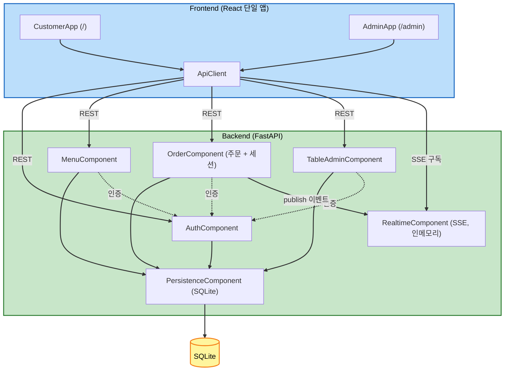

# 컴포넌트 의존 관계 (Component Dependency)

## 의존성 매트릭스

| 컴포넌트 | 의존 대상 | 관계/통신 패턴 |
|----------|-----------|----------------|
| AuthComponent (C1) | PersistenceComponent | AdminUser/Table/TableSession 조회, DB 세션 |
| MenuComponent (C2) | PersistenceComponent, AuthComponent(관리자 CRUD 보호) | DB 접근, 관리자 인증 의존성 |
| OrderComponent (C3) | PersistenceComponent, AuthComponent, RealtimeComponent | DB 접근, 인증 의존성, 이벤트 발행 |
| TableAdminComponent (C4) | PersistenceComponent, AuthComponent | DB 접근, 관리자 인증 의존성 |
| RealtimeComponent (C5) | (없음 — 인메모리 이벤트 버스) | 다른 컴포넌트가 publish 호출, 관리자 stream 구독 |
| PersistenceComponent (C6) | (없음 — 최하위 계층) | SQLite |
| CustomerApp (F1) | ApiClient | REST 호출 |
| AdminApp (F2) | ApiClient | REST + SSE 구독 |
| ApiClient (F3) | 백엔드 REST/SSE | HTTP / EventSource |

## 통신 패턴 요약

- **프론트 ↔ 백엔드**: REST(JSON) + SSE(관리자 실시간). 인증은 Bearer 토큰(관리자 JWT / 테이블 토큰).
- **백엔드 내부**: 라우터 핸들러 → 헬퍼/DB(직접) → 필요 시 RealtimeComponent.publish 호출.
- **실시간 전파**: OrderComponent가 상태 변화 시 이벤트 발행 → RealtimeComponent가 관리자 SSE 구독자에게 전파.

## 컴포넌트 다이어그램 (Mermaid)



## 컴포넌트 다이어그램 (Text Alternative)

```
Frontend (React 단일 앱)
  CustomerApp (/)  ---+
  AdminApp (/admin) --+--> ApiClient
                           |
        REST ------------- +--> AuthComponent -----> PersistenceComponent --> SQLite
        REST -------------  --> MenuComponent -----> PersistenceComponent
        REST -------------  --> OrderComponent ----> PersistenceComponent
        REST -------------  --> TableAdminComponent-> PersistenceComponent
        SSE 구독 ----------  --> RealtimeComponent (인메모리)

  인증 의존성: MenuComponent / OrderComponent / TableAdminComponent --> AuthComponent
  이벤트 발행: OrderComponent --publish--> RealtimeComponent --SSE--> AdminApp
```

## 데이터 흐름 (핵심)

1. **주문 생성**: CustomerApp → REST → OrderComponent → (세션 확보 + 저장) → publish(order_created) → SSE → AdminApp 대시보드 갱신
2. **상태 변경/삭제**: AdminApp → REST → OrderComponent → 저장 → publish → SSE → 모든 관리자 대시보드 동기화
3. **세션 종료**: AdminApp → REST → OrderComponent.close_table_session(트랜잭션: 이력 이동 + 리셋) → publish(table_session_closed) → SSE
