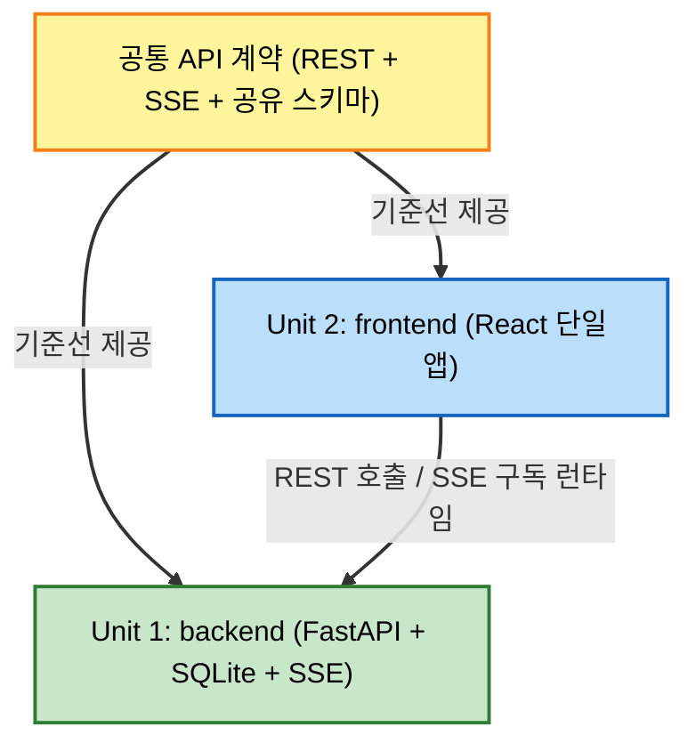

# Unit of Work Dependency (유닛 간 의존성)

## 의존성 매트릭스

| 유닛 | 의존 대상 | 관계/통신 | 방향 |
|------|-----------|-----------|------|
| `backend` (Unit 1) | 공통 API 계약(0장) | 계약을 **구현**(서버 측) | 계약 준수 |
| `frontend` (Unit 2) | 공통 API 계약(0장), `backend` | 계약을 **소비**(REST 호출 + SSE 구독) | frontend → backend |
| 공통 API 계약(0장) | (없음) | 두 유닛의 기준선 | — |

- **런타임 의존**: `frontend` → `backend` (HTTP REST + SSE). 단방향.
- **개발 의존**: 두 유닛 모두 → 공통 API 계약(0장). 계약이 먼저 확정되면 두 유닛은 서로를 기다리지 않고 병렬 진행 가능.
- **순환 의존 없음.** ✅

## 의존성 다이어그램 (Mermaid)



## 의존성 다이어그램 (Text Alternative)

```
[공통 API 계약]  ──기준선──▶  Unit 1: backend
       │
       └──────기준선──────▶  Unit 2: frontend

런타임: Unit 2 frontend  ──REST 호출 / SSE 구독──▶  Unit 1: backend
개발:  두 유닛 모두 공통 API 계약(0장)에 의존. 계약 확정 후 병렬 진행.
순환 의존 없음.
```

## 진행 순서 (병렬 + 선행 계약)

1. **선행**: 공통 API 계약 확정 (unit-of-work.md 0장) — 두 유닛의 인터페이스 기준선.
2. **병렬**: `backend`(계약 구현)와 `frontend`(계약 소비) 동시 진행.
   - frontend는 계약 기반으로 UI/ApiClient를 개발(필요 시 계약에 맞춘 목 응답 사용).
   - backend는 계약에 맞춰 서버를 구현.
3. **통합**: docker-compose 구성 및 종단 연결/검증은 Build and Test 단계.

## 리스크/주의

- 병렬 진행 중 **계약 변경**이 필요하면 양 유닛에 동시 반영해야 함(Functional Design 단계에서 계약 확정 후 큰 변경 지양).
- SSE 이벤트 payload 형태는 계약(0.3)에 고정되어야 frontend 대시보드가 backend와 정합.
