# Execution Plan

## Detailed Analysis Summary

### Transformation Scope
- **Project Type**: Greenfield (신규 구축) — Brownfield 관련 분석 항목은 N/A
- **Primary Changes**: FastAPI 백엔드 + React 프론트엔드(고객/관리자) + SQLite 데이터 저장소를 신규 구축, 로컬 Docker Compose로 기동

### Change Impact Assessment
- **User-facing changes**: Yes — 고객용/관리자용 두 웹 인터페이스 신규 구축
- **Structural changes**: Yes — 전체 시스템 아키텍처 신규 정의 (프론트엔드/백엔드/DB)
- **Data model changes**: Yes — Store, Table, TableSession, Menu, Category, Order, OrderItem, OrderHistory 등 신규 스키마
- **API changes**: Yes — 인증/메뉴/주문/세션/SSE 등 신규 REST + SSE 엔드포인트
- **NFR impact**: Yes — SSE 실시간성(2초 이내), 16시간 JWT 세션, bcrypt 해싱, 로컬 배포 단순성

### Risk Assessment
- **Risk Level**: Medium
- **Rollback Complexity**: Easy (신규 프로젝트, 로컬 환경)
- **Testing Complexity**: Moderate (SSE 실시간, 세션 라이프사이클, 현재-세션 필터링 등 통합 시나리오)

---

## Workflow Visualization

### Mermaid Diagram

```mermaid
flowchart TD
    Start(["User Request"])

    subgraph INCEPTION["INCEPTION PHASE"]
        WD["Workspace Detection<br/><b>COMPLETED</b>"]
        RA["Requirements Analysis<br/><b>COMPLETED</b>"]
        US["User Stories<br/><b>COMPLETED</b>"]
        WP["Workflow Planning<br/><b>IN PROGRESS</b>"]
        AD["Application Design<br/><b>EXECUTE</b>"]
        UG["Units Generation<br/><b>EXECUTE</b>"]
    end

    subgraph CONSTRUCTION["CONSTRUCTION PHASE"]
        FD["Functional Design<br/><b>EXECUTE</b>"]
        NFRA["NFR Requirements<br/><b>EXECUTE</b>"]
        NFRD["NFR Design<br/><b>EXECUTE</b>"]
        ID["Infrastructure Design<br/><b>EXECUTE</b>"]
        CG["Code Generation<br/><b>EXECUTE</b>"]
        BT["Build and Test<br/><b>EXECUTE</b>"]
    end

    subgraph OPERATIONS["OPERATIONS PHASE"]
        OPS["Operations<br/><b>PLACEHOLDER</b>"]
    end

    Start --> WD
    WD --> RA
    RA --> US
    US --> WP
    WP --> AD
    AD --> UG
    UG --> FD
    FD --> NFRA
    NFRA --> NFRD
    NFRD --> ID
    ID --> CG
    CG --> BT
    BT --> OPS
    BT --> End(["Complete"])

    style WD fill:#4CAF50,stroke:#1B5E20,stroke-width:3px,color:#fff
    style RA fill:#4CAF50,stroke:#1B5E20,stroke-width:3px,color:#fff
    style US fill:#4CAF50,stroke:#1B5E20,stroke-width:3px,color:#fff
    style WP fill:#4CAF50,stroke:#1B5E20,stroke-width:3px,color:#fff
    style AD fill:#FFA726,stroke:#E65100,stroke-width:3px,stroke-dasharray: 5 5,color:#000
    style UG fill:#FFA726,stroke:#E65100,stroke-width:3px,stroke-dasharray: 5 5,color:#000
    style FD fill:#FFA726,stroke:#E65100,stroke-width:3px,stroke-dasharray: 5 5,color:#000
    style NFRA fill:#FFA726,stroke:#E65100,stroke-width:3px,stroke-dasharray: 5 5,color:#000
    style NFRD fill:#FFA726,stroke:#E65100,stroke-width:3px,stroke-dasharray: 5 5,color:#000
    style ID fill:#FFA726,stroke:#E65100,stroke-width:3px,stroke-dasharray: 5 5,color:#000
    style CG fill:#4CAF50,stroke:#1B5E20,stroke-width:3px,color:#fff
    style BT fill:#4CAF50,stroke:#1B5E20,stroke-width:3px,color:#fff
    style OPS fill:#BDBDBD,stroke:#424242,stroke-width:2px,stroke-dasharray: 5 5,color:#000
    style INCEPTION fill:#BBDEFB,stroke:#1565C0,stroke-width:3px,color:#000
    style CONSTRUCTION fill:#C8E6C9,stroke:#2E7D32,stroke-width:3px,color:#000
    style OPERATIONS fill:#FFF59D,stroke:#F57F17,stroke-width:3px,color:#000
    style Start fill:#CE93D8,stroke:#6A1B9A,stroke-width:3px,color:#000
    style End fill:#CE93D8,stroke:#6A1B9A,stroke-width:3px,color:#000

    linkStyle default stroke:#333,stroke-width:2px
```



### Text Alternative

```
INCEPTION PHASE
- Workspace Detection ....... COMPLETED
- Requirements Analysis ..... COMPLETED
- User Stories .............. COMPLETED
- Workflow Planning ......... IN PROGRESS
- Application Design ........ EXECUTE
- Units Generation .......... EXECUTE

CONSTRUCTION PHASE (per-unit loop, then Build & Test)
- Functional Design ......... EXECUTE (per-unit)
- NFR Requirements .......... EXECUTE (per-unit)
- NFR Design ................ EXECUTE (per-unit)
- Infrastructure Design ..... EXECUTE (per-unit)
- Code Generation ........... EXECUTE (per-unit, ALWAYS)
- Build and Test ............ EXECUTE (ALWAYS)

OPERATIONS PHASE
- Operations ................ PLACEHOLDER
```

---

## Phases to Execute

### 🔵 INCEPTION PHASE
- [x] Workspace Detection (COMPLETED)
- [x] Reverse Engineering (SKIPPED — Greenfield, 기존 코드 없음)
- [x] Requirements Analysis (COMPLETED)
- [x] User Stories (COMPLETED)
- [x] Execution Plan (IN PROGRESS)
- [ ] Application Design - **EXECUTE**
  - **Rationale**: 신규 컴포넌트/서비스(인증, 메뉴, 주문, 세션, SSE 브로드캐스트) 정의 필요, 서비스 계층 및 컴포넌트 의존성 명확화 필요
- [ ] Units Generation - **EXECUTE**
  - **Rationale**: 신규 데이터 모델·다수 API 엔드포인트·상태 관리(세션)·프론트엔드/백엔드 분리로 인해 작업 단위 분해가 유익

### 🟢 CONSTRUCTION PHASE (각 유닛별로 반복)
- [ ] Functional Design - **EXECUTE**
  - **Rationale**: 신규 데이터 모델과 복잡한 비즈니스 로직(테이블 세션 라이프사이클, 현재-세션 필터링, 주문 상태 흐름) 상세 설계 필요
- [ ] NFR Requirements - **EXECUTE**
  - **Rationale**: SSE 성능(2초 이내), 16시간 세션, 인증/보안(bcrypt, 시도 제한) 등 NFR 존재. 기술 스택은 대부분 확정되었으나 유닛별 NFR 정리 필요
- [ ] NFR Design - **EXECUTE**
  - **Rationale**: NFR Requirements 실행에 따라 NFR 패턴(SSE 브로드캐스트, JWT 미들웨어 등)을 설계에 반영
- [ ] Infrastructure Design - **EXECUTE (경량)**
  - **Rationale**: 로컬 Docker Compose 구성(backend, frontend, SQLite 볼륨) 매핑 필요. 클라우드 아님이므로 경량 수준
- [ ] Code Generation - **EXECUTE (ALWAYS)**
  - **Rationale**: 구현 계획 및 코드 생성 필요
- [ ] Build and Test - **EXECUTE (ALWAYS)**
  - **Rationale**: 빌드·테스트·검증 필요 (SSE/세션 통합 시나리오 포함)

### 🟡 OPERATIONS PHASE
- [ ] Operations - PLACEHOLDER
  - **Rationale**: 향후 배포/모니터링 워크플로우용 (현재 범위 아님)

---

## Estimated Timeline
- **Total Phases to Execute (남은 단계)**: INCEPTION 2개(Application Design, Units Generation) + CONSTRUCTION per-unit 설계 + Code Generation + Build and Test
- **Estimated Duration**: 유닛 수에 따라 변동 (Units Generation에서 확정). 대략 3~5개 유닛 예상.

## Success Criteria
- **Primary Goal**: 로컬 Docker Compose로 기동되는 MVP 테이블오더 서비스 (고객용 + 관리자용) 동작
- **Key Deliverables**:
  - FastAPI 백엔드 (인증, 메뉴, 주문, 세션, SSE)
  - React 프론트엔드 (고객용 UI, 관리자용 UI)
  - SQLite 스키마 + 데모용 시드 데이터
  - Docker Compose 구성
  - 단위/통합 테스트
- **Quality Gates**:
  - 각 스토리의 acceptance criteria 충족
  - SSE 신규 주문 2초 이내 반영
  - 테이블 세션 라이프사이클(첫 주문→이용 완료→이력 이동) 정상 동작
  - 현재 세션 주문만 고객 화면에 표시
